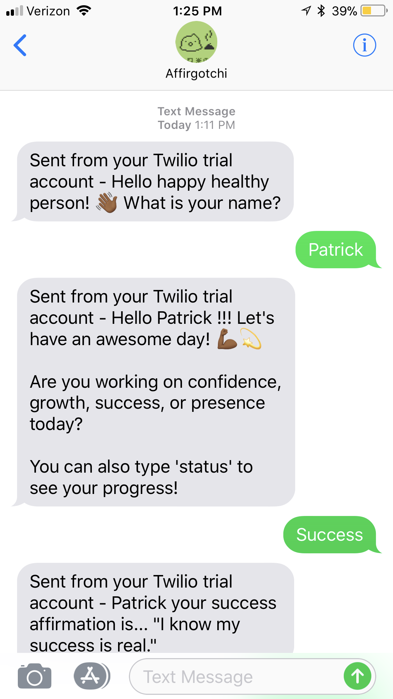
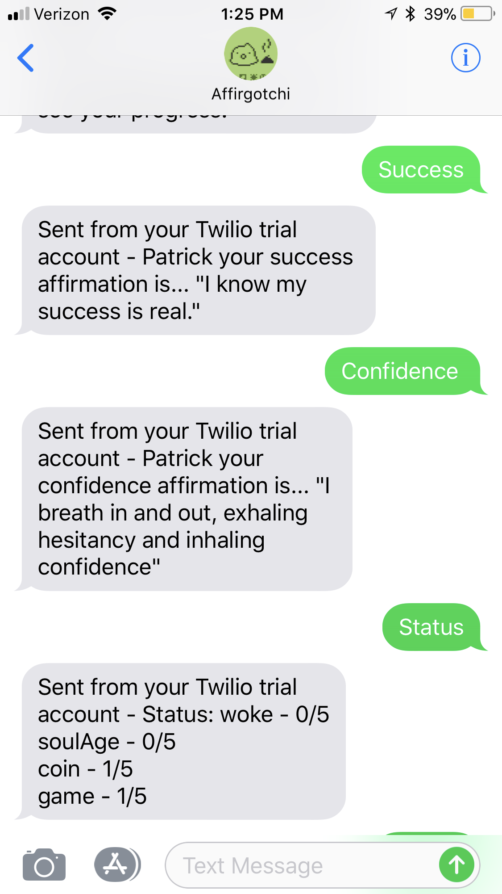
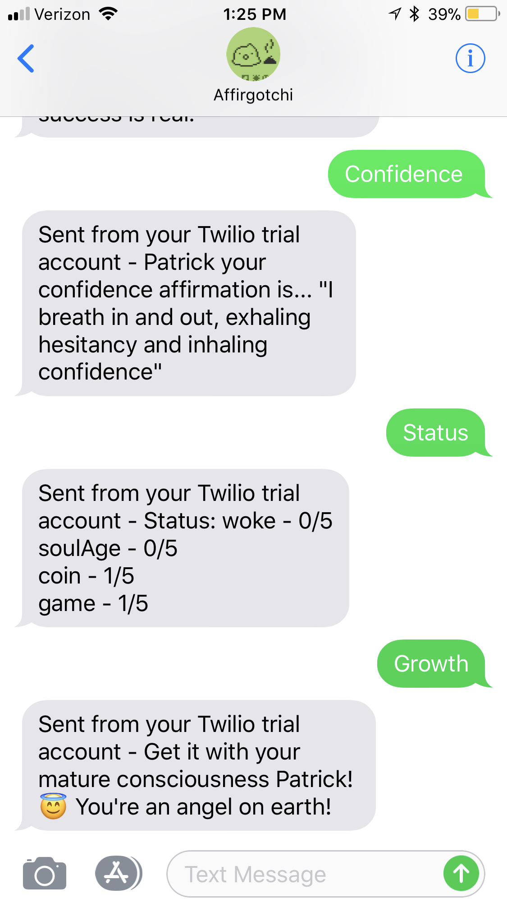

# twilio-affirgotchi

An affirmation game app using the twilio API. Affirmations are a powerful way to take personal control of your health and wellness. With this Affirgotchi, you get random affirmations based off of 4 categories. 

1. Confidence 
1. Growth
1. Success
1. Presence

Your Affirgotchi will keep track of your status in the following areas. Try to get 3 affirmations in in each category:

1. Woke - How woke are you, really?
1. Soul Age - How developed is your consciousness?
1. Coin - The value you bring to the world is reflected back to you?
1. Game - Is your confidence serving you in the world?

[Check out a demo on YouTube](https://youtu.be/dmxpCd9JIWE)

# Setting up Development Environment

- Fork and/or clone the repository
- Set environment variables 
  - change the name of `.env.variables` to `.env`
  - Set TWILIO_ACCOUNT_SID, TWILIO_AUTH_TOKEN, TWILIO_NUMBER, and MY_NUMBER
  - Setup your account and get your credentials at [twilio.com](https://www.twilio.com/) 
- `npm install`
- `npm start`

# Technical Stack 

- JavaScript
- Node
- Express
- Twilio 

